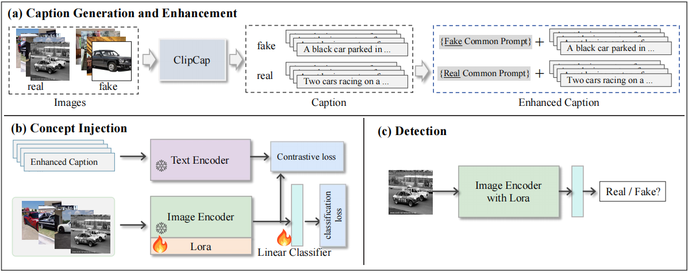

# Data-Independent Operator: A Training-Free Artifact Representation Extractor for Generalizable Deepfake Detection

[Chuangchuang Tan](https://scholar.google.com/citations?user=ufR1PmMAAAAJ&hl=zh-CN), [Renshuai Tao](https://rstao-bjtu.github.io/), [Huan Liu](), [Guanghua Gu](), [Baoyuan Wu](), [Yao Zhao](https://scholar.google.com/citations?hl=zh-CN&user=474TbQYAAAAJ), [Yunchao Wei](https://weiyc.github.io/)

Beijing Jiaotong University, YanShan University, CUHK

Reference github repository for the paper [C2P-CLIP: Injecting Category Common Prompt in CLIP to Enhance Generalization in Deepfake Detection](https://arxiv.org/abs/2408.09647).
```
@article{tan2024c2p,
  title={C2P-CLIP: Injecting Category Common Prompt in CLIP to Enhance Generalization in Deepfake Detection},
  author={Tan, Chuangchuang and Tao, Renshuai and Liu, Huan and Gu, Guanghua and Wu, Baoyuan and Zhao, Yao and Wei, Yunchao},
  journal={arXiv preprint arXiv:2408.09647},
  year={2024}
}
```
:star: If Our code is helpful to your images or projects, please help star this repo. Thanks! :hugs:


# **Overall Pipeline**
<p align="center">

</p>


### TODO
- ~~[ ] Update link to paper~~  
- ~~[ ] Pretrained models~~ 
- ~~[ ] Inference Code~~
- ~~[ ] Detection decoding Code~~
- [ ] Making the environment consistent.
- [ ] Training Code


## **Decoding CLIP feature/Detection feature to text** 

```
python decode_clipfeature_image.py --image_path ./assets/DALLE/DALLE_2_Cowboy_In_Swamp_Close_Up_Outpaint_1.png --cal_detection_feat
```

### [CLIPCap](https://github.com/rmokady/CLIP_prefix_caption) Environment 
- python=3.8.5
- pytorch=2.3.1+cu118
- transformers=4.25.0


## **Detection Inference** 
```
python inference.py --dataroot {Test path}
```

### Environment setup
- Python=3.10.14
- pytorch=2.3.0+cu118
- transformers=4.42.3


## Acknowledgments

This repository borrows partially from the [CLIPCap](https://github.com/rmokady/CLIP_prefix_caption), [NPR](https://github.com/chuangchuangtan/NPR-DeepfakeDetection).
